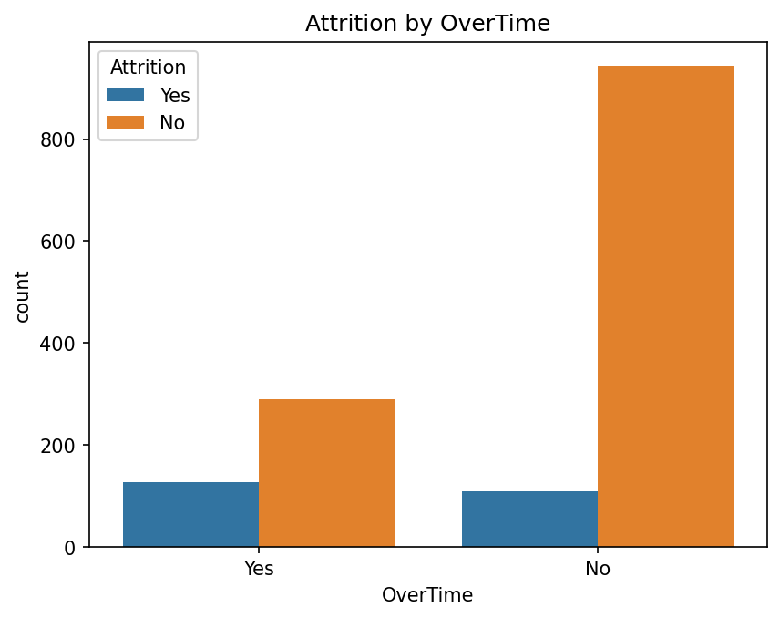
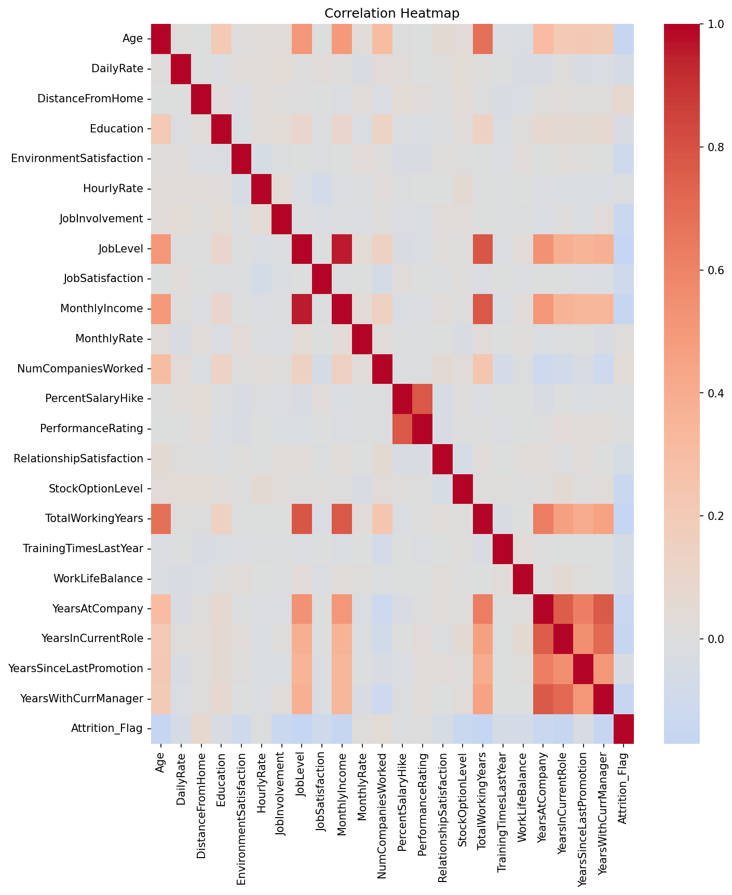
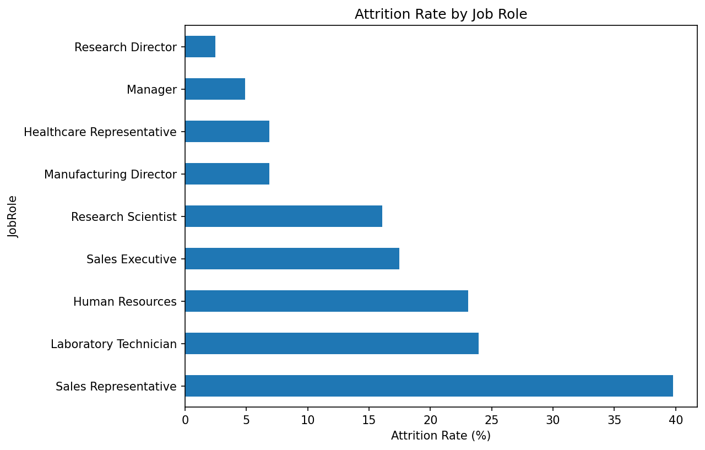
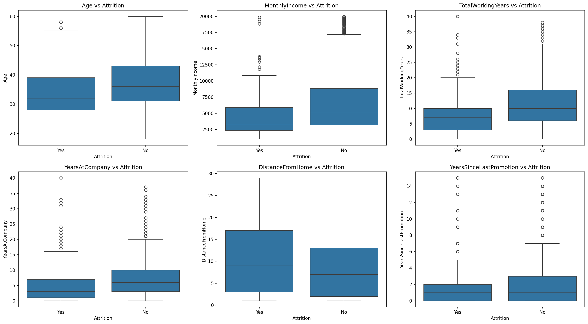

# HR Employee Attrition — Exploratory Data Analysis

Exploratory Data Analysis on the IBM HR Employee Attrition dataset, identifying 
key factors associated with employee attrition.

## Dataset
Source: [IBM HR Analytics Employee Attrition Dataset](https://www.kaggle.com/datasets/pavansubhasht/ibm-hr-analytics-attrition-dataset)  
1,470 employee records, 35 original features (32 after removing constant columns).

## Objective
Identify which employee attributes (compensation, tenure, overtime, satisfaction 
scores, job role) are most associated with attrition, and surface findings a 
business could realistically act on.

## Key Findings
1. OverTime is the strongest single driver of attrition (~30.5% vs ~10.4%).
2. Attrition skews toward younger, lower-income, shorter-tenured employees.
3. Job satisfaction and involvement scores show a consistent inverse relationship 
   with attrition.
4. Attrition is highly uneven across job roles — Sales Representative shows the 
   highest rate (~39.8%).
5. OverTime and low job satisfaction compound each other (34–38% attrition when 
   both are present).

## Visuals









## Tech Used
Python, Pandas, NumPy, Matplotlib, Seaborn, Jupyter Notebook

## Project Structure
```
hr-attrition-eda/
├── data/                  # raw and cleaned dataset
├── notebooks/             # main EDA notebook
├── images/                # saved plots used in this README
├── requirements.txt
└── README.md
```

## How to Run
```bash
git clone https://github.com/Shreyashs-dg/hr-attrition-eda.git
cd hr-attrition-eda
pip install -r requirements.txt
jupyter notebook notebooks/01_eda_hr_attrition.ipynb
```

## Limitations
This is a single-snapshot dataset — findings show correlation, not causation. 
The dataset is also imbalanced (~84% stayed vs ~16% left), which should be 
accounted for in any follow-up predictive modeling.

## Next Steps
Build a classification model to predict Attrition using the features identified 
here (OverTime, MonthlyIncome, JobSatisfaction, JobRole, tenure-related features), 
with class imbalance handled appropriately.

